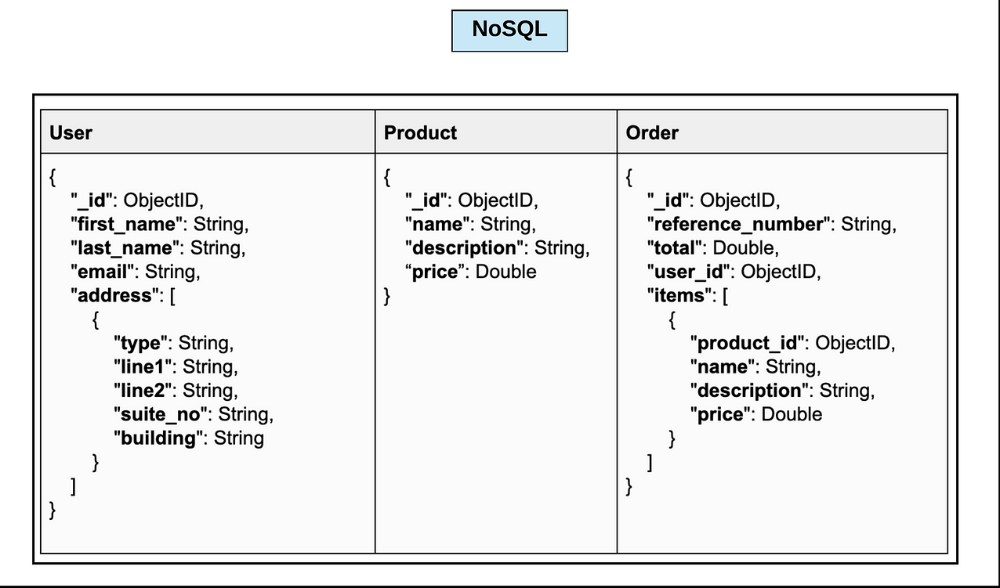
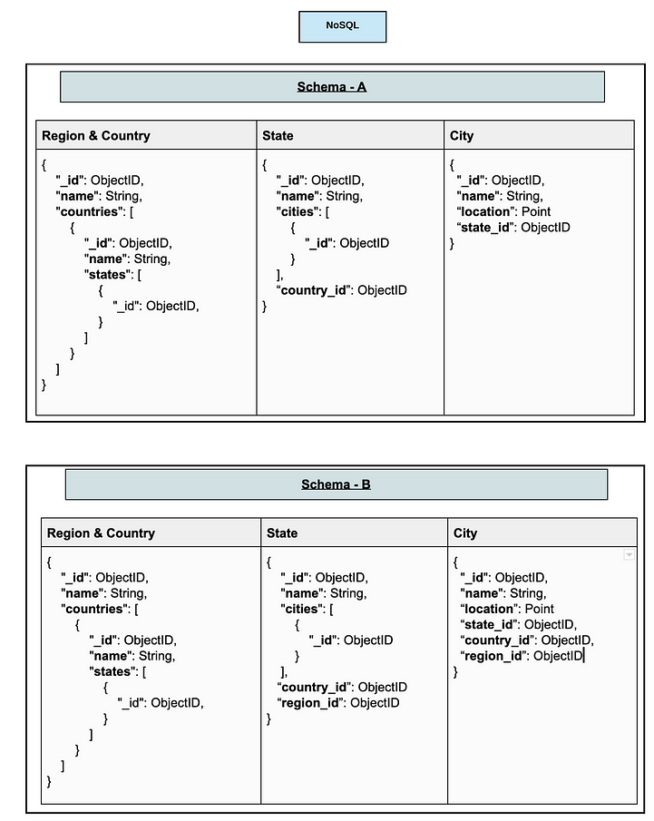
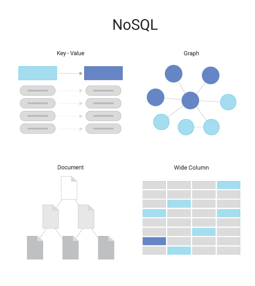
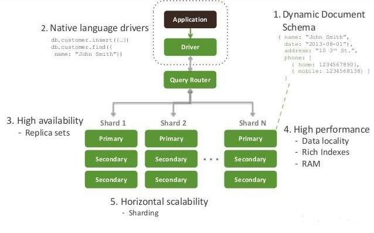

# NoSQL
***
## What is NoSQL
***
NoSQL (Not Only SQL) is an approach to databases that do not follow the traditional relational database management approach. NoSQL databases are more flexible in how they store information.  
 
## SQL vs NoSQL
***

|                    | SQL                                 |                                                                                          NoSQL |
|--------------------|-------------------------------------|-----------------------------------------------------------------------------------------------:|
| **Type**           | RDBMS                               |                                                       Various. No single restrictive structure |
| **Schema**         | Fixed schema                        |                                                                                 Dynamic schema |
| **Query Language** | SQL                                 | Varies depending on database Can be written(MongoDB Query Language, Cassandra, JSON, XML, etc. |
| **Scalability**    | Vertical scaling                    |                                                                             Horizontal Scaling |
| **Flexibility**    | Rigid, structured data requirements |                               Very flexible, can contain unstructured and semi structured data |  
 

## NoSQL Schema Design Examples
***

  

 

## Types of NoSQL Databases
***
  
 

# MongoDB
***

## What is MongoDB
***
MongoDB is a NoSQL database management system that stores data in JSON-like documents designed for high scalability.  
 
## Collections and Documents in MongoDB
***
In relation to MongoDB a collection is a grouping of MongoDB documents which can be roughly equated to a relational database table. It does not enforce a fixed schema so documents can have different structures.    
Documents are a record in a MongoDB collection and the basic unit of data in MongoDB. They are analogous to JSON objects but exist in the database in a more type-rich format known as BSON.
 

## MongoDB Architecture
***

Replica sets are groups of servers that contain the same data allowing for data to be manipulated while still having an original, unaltered version available.  
 
Sharding is a method of splitting data into 'shards' and storing them across multiple servers, it is an implementation of horizontal scaling that improves performance, scalability and availability.

## Pros and Cons of MongoDB
***
